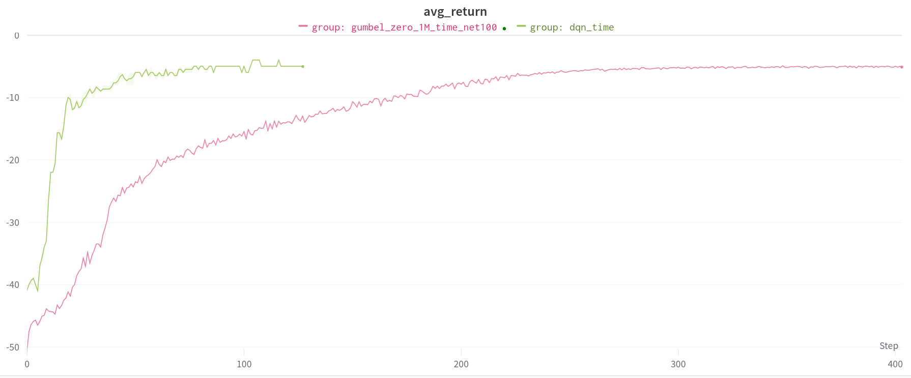
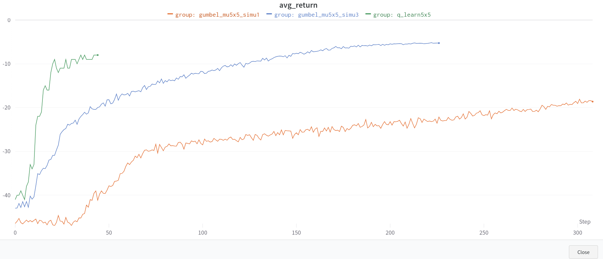
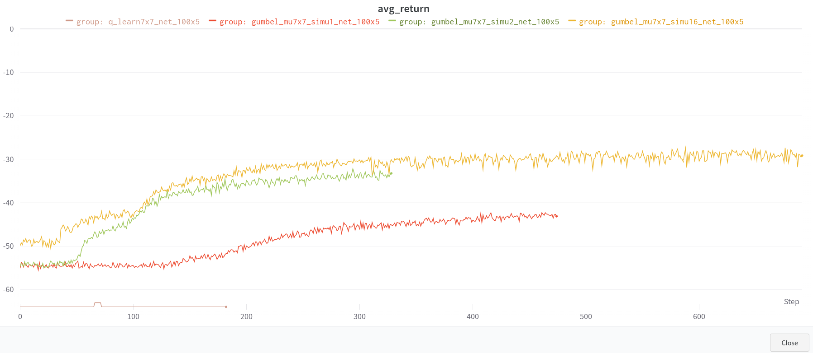

###  RL-algos in Maze
Compare the performance and training speed between Q-learning and Muzero in maze environment.       
### Conclusion
Muzero learns pretty slow, but is more powerful, because you can increase the simulation budget to solve more difficult environment, with the cost of more training time.  (which (I guess) is the main reason why [mctx](https://github.com/google-deepmind/mctx) using jax instead of something like tensorflow or pytorch, because jax's xla will speed up the training time, and treemap is also convenient for building mcts)       
### acknowledge     
code and algos are from these projects
- [mctx](https://github.com/google-deepmind/mctx)  for gumbel muzero
- [mctx_learning_demo](https://github.com/kenjyoung/mctx_learning_demo)  for maze environment
- [jax-rl](https://github.com/erees1/jax-rl)  for q-learning     
     
### results
#### in 5x5 maze:    
network-structure--> [100]*3      
gumbel muzero (with 5 simu budget) and Qlearning can both solve the 5x5 maze (because it's a simple problem).       
But gumbel muzero (with 5 simu budget) takes more times to solve the problem than Q-learning.    
gumbel muzero (with 1 simu budget) learns significant slower than q-learning
#### in 7x7 maze: ( more difficult environment.)
network-structure--> [100]*5      
Q learning fails to learn anything useful            
gumbel muzero can learn something     

### 5x5 maze  (simple problem)
network-structure--> [100]*3
```sh
## qlearning with default network structure  [100,100,100,action_dim] in 5x5 maze
python algos/q_learn/main.py  --enable_wandb True --env_config.grid_size 5 --algo q_learn5x5_lay3_hid100
## muzero
python algos/gumbel_zero/main.py  --enable_wandb True --env_config.grid_size 5 --num_simulations 3 --algo muzero5x5_simu3_lay3_hid_100

```


```sh
python algos/gumbel_zero/main.py  --enable_wandb True --env_config.grid_size 5 --num_simulations 5 --algo gumbel_mu5x5_simu5
python algos/q_learn/main.py  --enable_wandb True --env_config.grid_size 5 --algo q_learn5x5
```
gumbel_muzero(5 simulations) vs dqn's reward,  each step's value is 10 second    
gumbel muzero (with 5 simu budget) converge slower than dqn, but both algos can solve this simple 5x5 maze.                       


```sh
python algos/gumbel_zero/main.py  --enable_wandb True --env_config.grid_size 5 --num_simulations 3 --algo gumbel_mu5x5_simu3
python algos/gumbel_zero/main.py  --enable_wandb True --env_config.grid_size 5 --num_simulations 1 --algo gumbel_mu5x5_simu1
```
gumbel muzero with one simution budget (orange) learns significantly slower than q_learnging   


### 7x7 maze  (more difficult problem)
network-structure--> [100]*5      

```sh
python algos/gumbel_zero/main.py  --enable_wandb True --env_config.grid_size 7 --num_hidden_layers 5 --num_simulations 16  --algo gumbel_mu7x7_simu16_net_100x5

python algos/gumbel_zero/main.py  --enable_wandb True --env_config.grid_size 7 --num_hidden_layers 5 --num_simulations 8  --algo gumbel_mu7x7_simu8_net_100x5

python algos/gumbel_zero/main.py  --enable_wandb True --env_config.grid_size 7 --num_hidden_layers 5 --num_simulations 4  --algo gumbel_mu7x7_simu4_net_100x5

python algos/q_learn/main.py  --enable_wandb True --env_config.grid_size 7 --n_layers 5  --algo q_learn7x7_net_100x5 

python algos/q_learn/main.py  --enable_wandb True --env_config.grid_size 7 --n_layers 7  --algo q_learn7x7_net_100x7 
```

q-learning fails to learn anything useful     
